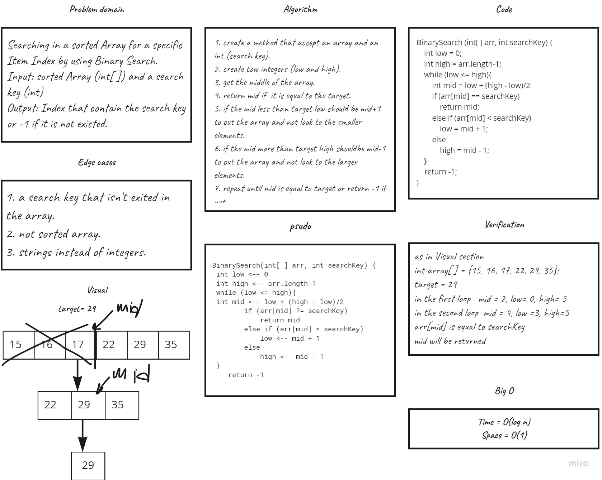

# Array Binary Search
This Application takes a sorted array and a search key, and give us the index of the array’s element that is equal to the value of the search key.

## Whiteboard Process

## Approach & Efficiency
Time complexity time of binary search is O(log n) because of the division multiple time.