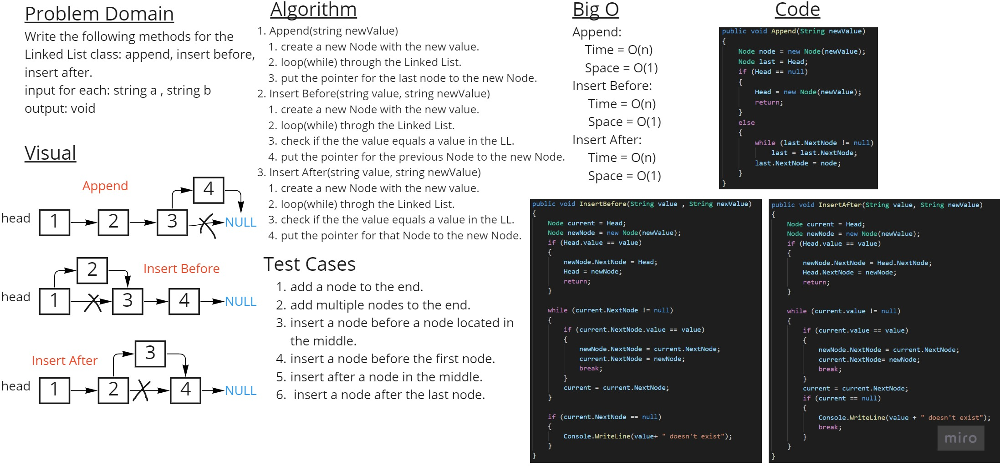

# Challenge Summary
Write the following methods for the Linked List class:
1. Append
2. Insert Before
3. Insert After

## Whiteboard Process

## Approach & Efficiency
Append method time complixity is O(n) 
Insert Before method time complixity is O(n) 
Insert After method time complixity is O(n) 

## Solution
To Append You should write: 
``list.Append("what you want to Append");`` 
To Insert 2 before 1 You should write: 
``list.InsertBefore("1" , "2");`` 
To Insert 3 after 2 You should write: 
``list.InsertAfter("2" , "3");`` 

here is an example: 

### Link to [Code](./LinkedList.cs)