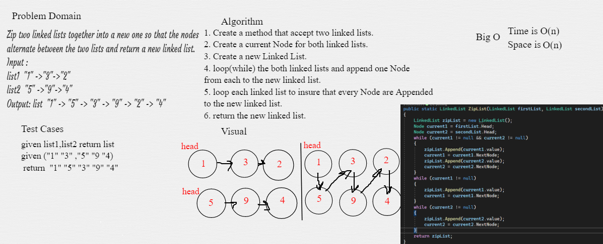

# Challenge Summary
Write the following method for the Linked List class:
- ZipList: Zip two linked lists together into a new one so that the nodes
alternate between the two lists and return a new linked list.

## Whiteboard Process

## Approach & Efficiency
ZipList method time complixity is O(n)

## Solution
To Zip two linked lists you shoud create a new linked list like:
``LinkedList zippedList = LinkedList.ZipList(list1, list2);``

## Link to [Code](./LinkedList.cs)