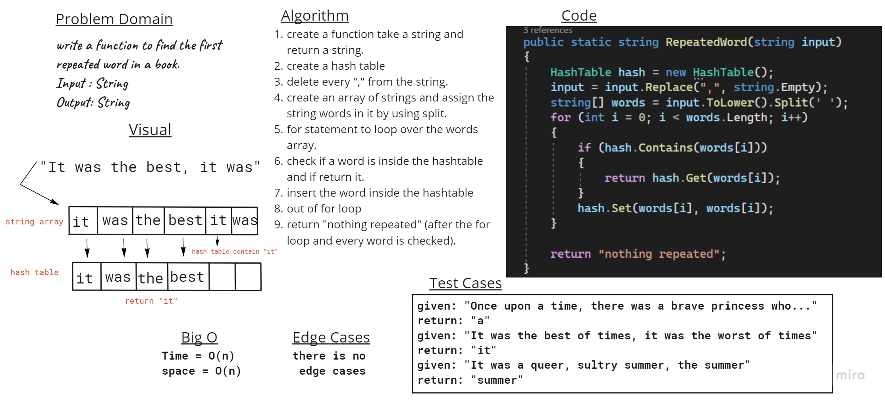

# Challenge Summary
Write a function called repeated word that finds the first word to occur more than once in a string.

## Whiteboard Process

## Approach & Efficiency
RepeatedWord Function time complixity is O(n)

## Solution
To find the first repeated word in a string you could write 
``HashTable.RepeatedWord("Your amazing string");``

## Link to [Code](../data-structures-project/HashTable.cs).
## Link to [Test](../TestDataStructuresProject/UnitTest1.cs).
