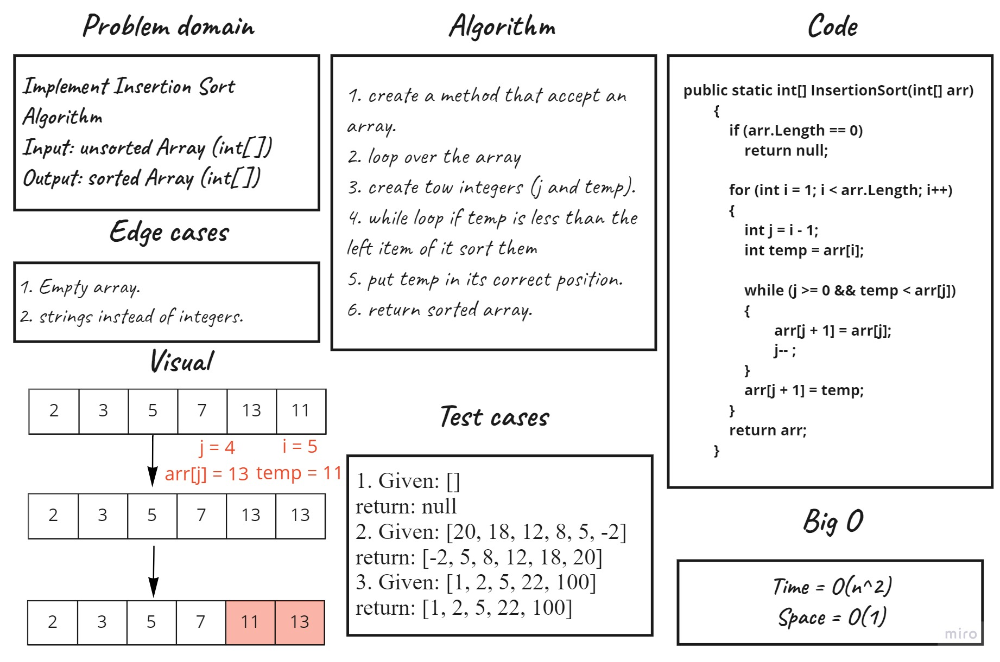

# Challenge Summary
Implement Insertion Sort Algorithm

## Whiteboard Process

## Approach & Efficiency
Big O for Insertion Sort function is O(n^2)

## Solution
To use InsersionSort function you should have an array and bass it like this:

``SortingAlgorithms.InsertionSort(array);``

## Link To [Code](../../data-structures-project/SortingAlgorithms.cs) 

## Link To [Blog](./BLOG.md)