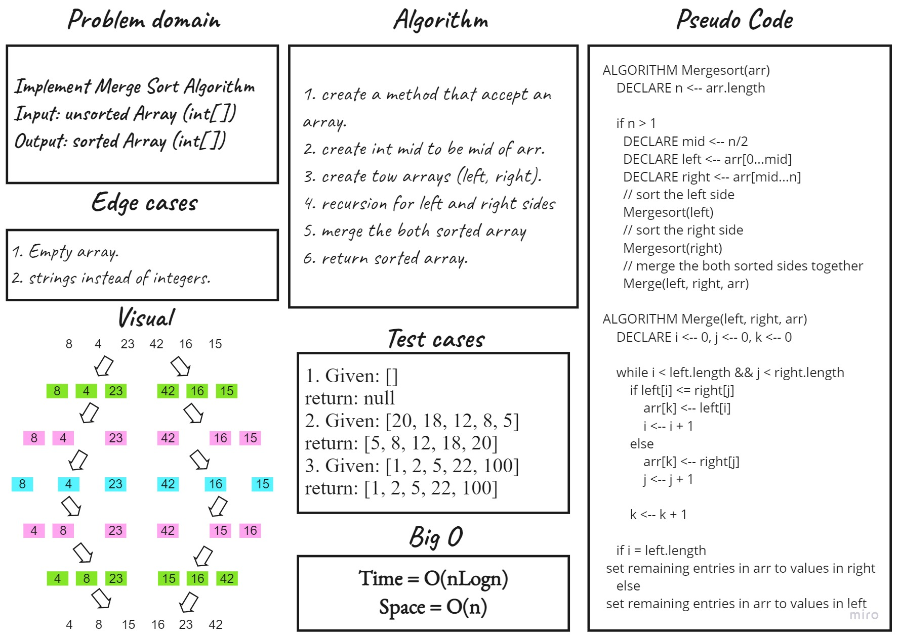

# Challenge Summary
Implement Merge Sort Algorithm

## Whiteboard Process

## Approach & Efficiency
MergeSort function time complixity is O(nLogn)

## Solution
To use MergeSort function you should have an array and bass it like this:

``SortingAlgorithms.MergeSort(array);``

## Link To [Code](../../data-structures-project/SortingAlgorithms.cs) 
## Link To [BLOG](./BLOG.md) 
