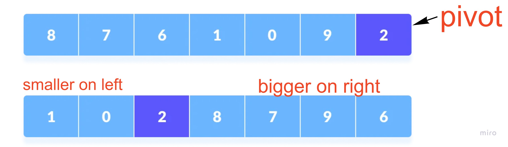
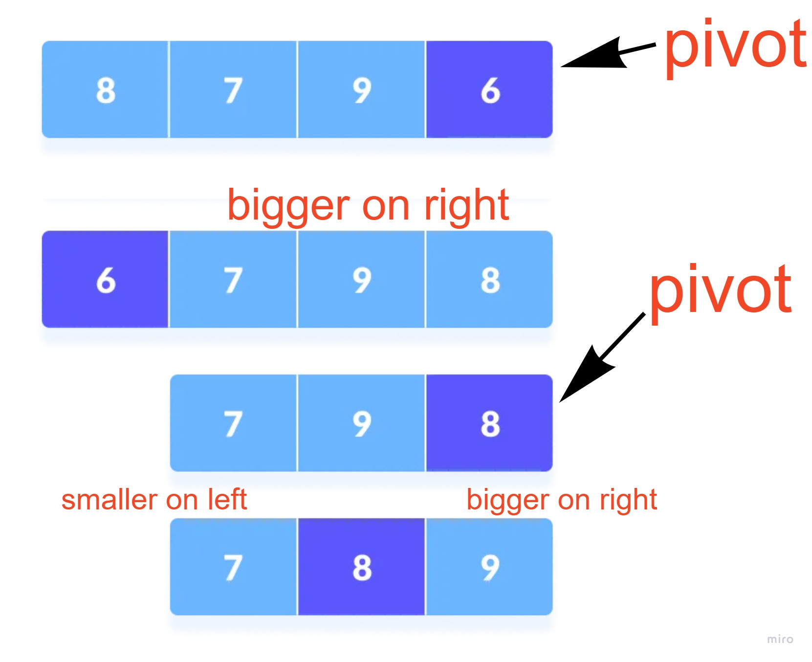

# Quick Sort
Quicksort is a sorting algorithm based on the divide and conquer approach where array is divided into subarrays by selecting a pivot element then put smaller elements before it and bigger elements after.<br>
The left and right subarrays are also divided using the same approach. This process continues until each subarray contains a single element and finally, combine elements to a sorted array.

## Pseudocode
```csharp
ALGORITHM QuickSort(arr, left, right)
    if left < right
        // Partition the array by setting the position of the pivot value
        DEFINE position <-- Partition(arr, left, right)
        // Sort the left
        QuickSort(arr, left, position - 1)
        // Sort the right
        QuickSort(arr, position + 1, right)

ALGORITHM Partition(arr, left, right)
    // set a pivot value as a point of reference
    DEFINE pivot <-- arr[right]
    // create a variable to track the largest index of numbers lower than the defined pivot
    DEFINE low <-- left - 1
    for i <- left to right do
        if arr[i] <= pivot
            low++
            Swap(arr, i, low)

     // place the value of the pivot location in the middle.
     // all numbers smaller than the pivot are on the left, larger on the right.
     Swap(arr, right, low + 1)
    // return the pivot index point
     return low + 1

ALGORITHM Swap(arr, i, low)
    DEFINE temp;
    temp <-- arr[i]
    arr[i] <-- arr[low]
    arr[low] <-- temp
```
## Trace
Sample Array: ``[8,7,6,1,0,9,2]``

### pase 1:

Select the Pivot Element and rearrange the Array

### pase 2:
```csharp
[1, 0] --> [0, 1]
```
Select pivot element of left part and sort it using swap method

### pase 3:

Select pivot element of right part and sort it using recursion


### pase 4:

Ta da... sorted array

## Efficency
### Time: O(n^2)
### Space: O(1)
