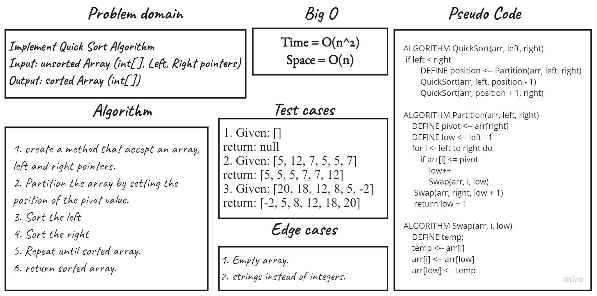

# Challenge Summary
Implement Quick Sort Algorithm

## Whiteboard Process

## Approach & Efficiency
QuickSort is a Divide and Conquer algorithm.
QuickSort function time complixity is O(n^2).

## Solution
To use QuickSort function you should have an array and bass it like this:

``SortingAlgorithms.QuickSort(array, left, rifgt);``

## Link To [Code](../../data-structures-project/SortingAlgorithms.cs) 

## Link To [Blog](./BLOG.md)