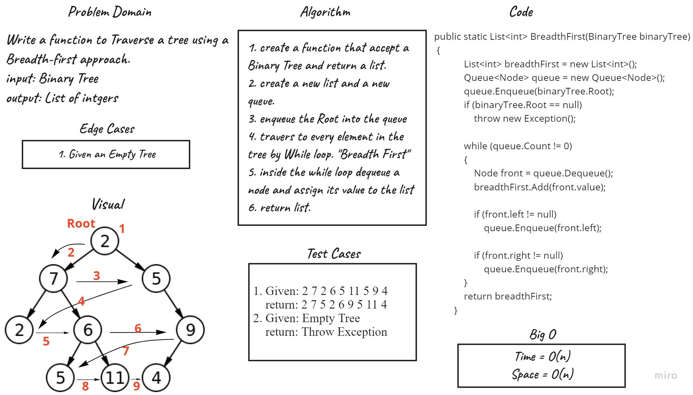

# Challenge Summary
Write a function to Traverse a tree using a Breadth-first approach.
input: Binary Tree
output: List of intgers

## Whiteboard Process

## Approach & Efficiency
BreadthFirst function time complixity is O(n)

## Solution
To use BreadthFirst function you should have a Tree and bass it like this:

``BinaryTree.BreadthFirst(tree);``

## Link to [Code](../Trees/Trees/BinaryTree.cs).
## Link to [Test](../Trees/TestTrees/UnitTest1.cs). 