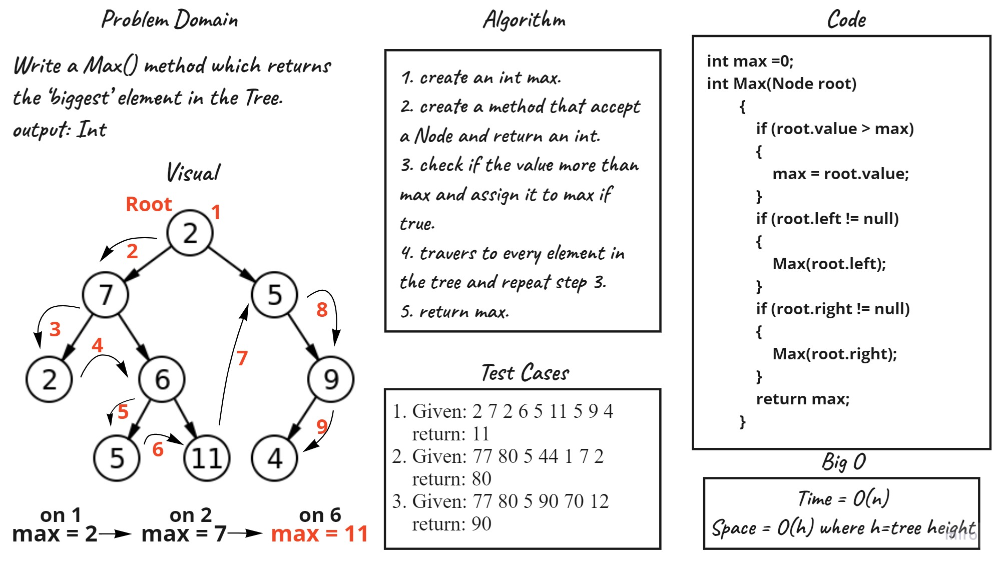

# Challenge Summary
Write a Max() method which returns the ‘biggest’ value in the Tree.

## Whiteboard Process

## Approach & Efficiency
Max method time complixity is O(n)

## Solution
To get max number from a Tree you can create a tree, add Nodes to it, and call Max(): 
``tree.Max()``

## Link to [Code](../Trees/Trees/BinaryTree.cs).
